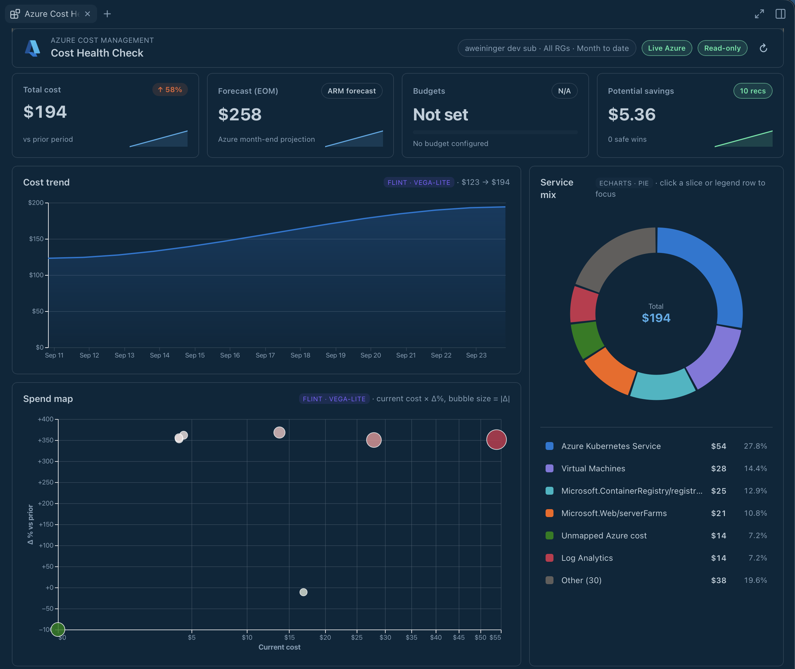

# Azure Cost Health Check

Read-only Azure cost, forecast, native budget/anomaly alerts, governance,
Advisor recommendations, and AI billing analysis for GitHub Copilot. The
plugin includes a canvas and a launcher skill; it is not a Claude Desktop MCPB.



## Install

If your organization has access to the `microsoft/azure-dev-tools`
marketplace, open GitHub Copilot **Customize > Plugins**, add
`microsoft/azure-dev-tools` (marketplace ID `azure-dev-tools`) using the
marketplace gear, and install `azure-cost-health-check` when it is listed.
This installs both the canvas and its launcher skill. Fully quit and reopen
GitHub Copilot, start a new chat, and check that the
`azure-cost-health-check` skill is available. If the plugin is not listed,
ask your marketplace administrator about access and availability.

The CLI equivalent is:

```sh
copilot plugin marketplace add microsoft/azure-dev-tools
copilot plugin install azure-cost-health-check@azure-dev-tools
```

To pin the *full plugin* to an exact version, obtain its published immutable
`azure-cost-health-check-v0-4-3-<source-qualifier>` tag from the marketplace
administrator. Replace the placeholder with that exact tag:

```sh
git clone --depth 1 --branch "<exact-published-tag>" https://github.com/microsoft/azure-dev-tools.git azure-cost-health-check-plugin
copilot plugin install ./azure-cost-health-check-plugin/canvases/azure-cost-health-check
```

**Canvas-only fallback:** If the `azure-cost-health-check-latest` tag is
available, use **Customize > Canvases > Install from gist/URL** with this
nested extension folder:

```text
https://github.com/microsoft/azure-dev-tools/tree/azure-cost-health-check-latest/canvases/azure-cost-health-check/com.github.copilot/extensions/azure-cost-health-check
```

The `-latest` tag can move; use an immutable version tag instead for an exact
version. The canvas-only fallback omits the launcher skill. Do not install it
alongside the full plugin, which would register duplicate providers.

## First read-only check

Install Azure CLI 2.61 or newer and sign in with `az login` outside the
canvas. You need read access to the selected subscriptions and the relevant
Cost Management, budget, resource, Advisor and AI billing APIs. Then ask:

> Open Azure Cost Health Check in real mode for my subscription.

Select the intended subscription(s) in the canvas before reading the report;
do not assume the CLI default is the desired scope. The dashboard first shows
spend and cost drivers, then forecasts, budgets, Advisor and native alerts,
then AI billing. **Loading**, missing permissions and partial coverage are
not zero usage. Native alert and analysis buttons request guidance in chat;
they do not authorize Azure writes.

## Build from source (maintainers)

From the source repository root, with Node 24 and locked dependencies:

```sh
npm ci
npm run package:plugin -- azure-cost-health-check
npm run verify:canvas -- artifacts/plugins/azure-cost-health-check
CANVAS_TEST_SELECTION='["azure-cost-health-check"]' npm run test:canvas-plugins
```

The emitted `artifacts/plugins/azure-cost-health-check` contains the plugin
manifest, launcher skill, README, third-party notices and bundled runtime.
Its nested `com.github.copilot/extensions/azure-cost-health-check` is the
canvas-only payload.
Install emitted artifacts, not the raw workspace directory; the host supplies
`@github/copilot-sdk/extension`. No npm install is required in the payload.
The source wrapper at `.github/extensions/azure-cost-health-check` is for
maintainer development; never enable it alongside an installed copy.
The plugin includes `THIRD_PARTY_NOTICES.txt` and the pinned chart licenses under
`notices/`; inclusion is not a substitute for release-owner rights review.

## Toolkit integration

The shared view store publishes each report in three stages: core spend and cost
drivers first; forecast, budgets, Advisor and native alerts next; AI billing and
attribution last. Pending sections say **Loading**, not zero spend or missing
budgets. SSE updates render the same canonical state used by agent actions; the
existing JSON endpoint and refresh action still return a complete report. Late
section failures remain visible without discarding already loaded results, and
AI updates do not reset an in-progress native-alert handoff.

New filters, refresh, auth invalidation and panel closure cancel that panel's
obsolete requests, queued rate-gate work, retry waits and active HTTP/body reads.
Retired actions reject with `stale_state`; current service errors remain explicit.
Reloading the document resumes its interrupted browser-owned report with the
same filters, without replacing an agent-owned refresh or reloading a completed
report. Service failures remain visible rather than being retried on reentry.
Profile discovery coalesces concurrent consumers and cancels when its last
consumer leaves. Toolkit-owned token acquisition remains shared across requests;
cancelling one waiter must not revoke another panel's credential acquisition.
Successful financial TTLs are unchanged. A report shares a fixed query clock,
bound metadata and query results across stages; caches remain partitioned by
toolkit identity, revision, tenant, cloud, account and subscription.

Cost Management still runs one request at a time, with at least one second
between starts and conservative cooldown/backoff. The longest applicable
`Retry-After`, `retry-after-ms` or Cost Management QPU/entity/tenant/client hint
is honored (bounded at 24 hours), without adding SDK retry policies.

Version 0.4.3 uses public `@microsoft/canvas-toolkit` exports:

- Owned Azure auth sessions discover the local CLI profile and bind each
  subscription to its tenant, account and cloud. ARM requests use SDK-cached token
  providers, not a subprocess per request. Sign-in remains an explicit terminal
  action; **Refresh subscriptions** reloads local profile metadata without
  logging in, changing the CLI default, or refreshing the shared profile from Azure.
  Invalidation notification failures are safely reported without interrupting
  cancellation of retired requests.
- Shared action validation gates both browser and agent operations, including
  string-valued tag dictionaries. `refresh_cost_health_check` now updates the open
  panel; the narrower `get_*` actions remain read-only projections.
- A versioned view store and SSE keep the panel and agent on the same in-process
  state. Newer requests win; auth changes and panel closure invalidate late results
  and plan handles. Refresh ownership also retires obsolete errors from browser
  and agent requests, while current failures and synchronization errors remain
  visible. Reopening the iframe preserves that panel's current result.
  Provider restart starts fresh from open input; view state is not persisted.
- The shared multi-select subscription picker preserves this dashboard's
  multi-tenant aggregation. It deliberately uses the lower-level
  `createSubscriptionPicker`, not the single-tenant/cloud/account Azure wrapper.
  Every requested subscription must bind unambiguously before querying; queries
  fan out through separate bound contexts and never silently narrow scope.
  Its opt-in field-style trigger matches the filter row's 32px controls, with
  one outline, left-aligned subscription text and a trailing chevron. Native
  selects retain their keyboard/dropdown behavior with matching custom arrows.
- Native alerts and remediation plans use `createSessionBridge`. The browser sends
  a current alert reference or an opaque plan handle, never executable prompt text.
  Plan handles are local to the panel, bounded, and invalidated by refresh.
- Shared styles and the command-activity component provide controls, accessible
  selection, and bounded operation progress. The specialized dashboard/chart
  styling remains app-owned.

The service adapter retains Cost Management POST pagination, billing-unit and
coverage semantics, rate gates, retry policy and identity-scoped TTL caching.
It also retains safe service error details and retry headers rather than passing
these calls through the generic GET-only `listArm` helper. Resource Graph analysis
uses explicit per-subscription ARM requests.

The custom loopback transport remains intentional: this Vega renderer requires
`unsafe-eval`, which `startCanvasServer` does not allow. No toolkit CSP was
weakened. Flint/Vega/ECharts, cost calculations, budget rules, attribution and
remediation templates are not toolkit functionality.

### HTTP transport and enterprise network settings

ARM reads use a streaming Azure SDK HTTP pipeline, not native `fetch`.
The pipeline does not follow redirects or add automatic retries; Cost Management
retry/rate policy remains in the canvas. Decompressed success/error bodies retain
the adapter's 16 MiB/64 KiB limits and safe service errors/retry headers.
Retry and cooldown classification uses structured HTTP status and service codes,
with the existing message fallback for legacy errors. A generic service message
does not bypass throttling, and exhausted throttles remain visible as throttled
capabilities.

The transport uses the extension process's inherited `HTTPS_PROXY`, `HTTP_PROXY`
and `ALL_PROXY` settings (including lowercase forms), with the Azure SDK's
`NO_PROXY` host/domain matching and an explicit `*` bypass. HTTP and HTTPS CONNECT
proxies are supported. Changing the inherited environment requires restarting
the provider; no CLI profile or machine proxy configuration is rewritten.

For custom trust, the first configured variable in this order supplies a PEM
certificate bundle: `REQUESTS_CA_BUNDLE`, `CURL_CA_BUNDLE`, `SSL_CERT_FILE`.
Bundles must be readable files of at most 4 MiB; directory-based trust stores
are not supported. The bundle replaces the default CA set for both the target
and an HTTPS proxy, with TLS verification still enabled. Unreadable or malformed
bundles fail explicitly; there is no insecure fallback. Without these variables,
normal Node trust applies, including `NODE_EXTRA_CA_CERTS` supplied at process
startup. Proxy credentials and certificate contents are not included in canvas
errors.

### Host appearance

The dashboard follows the GitHub app's delivered semantic colors, type roles,
button states and resolved theme tone using the shared toolkit stylesheet.
The old localStorage-backed light/system/dark toggle no longer overrides the
host. Without host theme delivery, the standalone OS fallback remains available.
Azure marks and categorical series colors retain their identity.

`observeCanvasTheme` updates chart labels, axes, grids and tooltips on late
delivery and live palette changes, including changes within the same tone.
Appearance updates neither requery Azure nor reset scope or recreate the pie
instance. Pending Vega renders are ownership-checked and retired on replacement.
The read-only `get_theme` action returns the browser's latest allowlisted
appearance report, or `pending` before a report arrives. It does not return
page contents or resource data; host-token presence is not proof of every token
or font being delivered.

## Import provenance and limits

Imported from `spboyer/azure-copilot-canvases`, commit
`275edeb6ad942411dc8d35d6aef824413eea7ed3`, path
`.github/extensions/azure-cost-health-v3/`, version 0.4.0 (including
`dc949a8`, Preserve AI billing read failures). The destination folder matches
the existing public canvas ID; the internal cache/provider names remain unchanged.
Runtime modules move into `src/`; test import paths follow that layout.
The source package lock is replaced by this repository's single root lock.
No other canvas, private local artifact, or generated Azure data is imported.

**Mock mode is not available in this import.** The upstream tracked tree does
not contain `artifacts/mock-cost-health.json`. Explicit mock mode and auto-mode
fallback therefore fail with a missing-file error. Use `mode: "real"` to retain
the actual Azure error; no synthetic data is substituted for tenant data.

The original ECharts 5.6.0 full bundle exceeded the unchanged 1,000,000-byte
installer limit. The initial import used a modular same-version build.
Candidate 0.4.1 upgrades ECharts to 6.1.0 to resolve dependency review
[GHSA-fgmj-fm8m-jvvx](https://github.com/advisories/GHSA-fgmj-fm8m-jvvx)
(CVE-2026-45249). The advisory concerns the Lines series, which this canvas does
not include, but the dependency must still be upgraded rather than exempted.
`src/charts.mjs` registers only PieChart,
TooltipComponent, LegendComponent, LabelLayout and SVGRenderer. It preserves
the service-mix donut, rich center labels, tooltips, emphasis/highlight, slice
and HTML-legend focus, resize, dark theme, and disposal APIs used by v3.
`npm run build:charts --workspace azure-cost-health-check` regenerates the
source-development asset. Packaging compiles the same entry directly, so it
does not trust a stale generated bundle. The three vendored Vega bundles retain
their source bytes; classic-script packaging preserves their browser globals.
No CDN, chart-asset splitting, or installer-limit exception is used. The toolkit
auth provider ships as a separate declared Node module so both server modules
remain below the same per-file cap.
Vendored browser versions are Vega 5.33.1, Vega-Lite 5.23.0 and Vega-Embed 6.29.0;
their bytes were compared to those exact npm release archives. Their licenses,
plus ECharts and zrender notices, ship under `notices/`. Bundled npm dependencies
also appear in the generated `THIRD_PARTY_NOTICES.txt`. Flint stays locked at
the source lockfile's 0.2.0, within the unchanged `^0.2.0` manifest range.
The Vega archive omits its license file; `docs/vega-LICENSE.txt` is copied from
the upstream [v5.33.1 license](https://github.com/vega/vega/blob/v5.33.1/LICENSE).
The provider/Flint bundle uses whitespace and syntax minification without
renaming identifiers, because v3 serializes named helpers into its browser code.

The inherited auto/mock fallback remains unchanged. Browser acceptance
uses injected toolkit credentials and synthetic ARM responses with a test-imposed
host-style CSP. Vega's inherited
expression compiler requires `unsafe-eval`; inline scripts are restricted to
hashes of the actual rendered document. A host that disallows `unsafe-eval`
needs a separate CSP-compatible Vega migration. This is not
live Azure, native App installation, or cross-platform certification.

## Checks

```sh
npm run check --workspace azure-cost-health-check
npm test --workspace azure-cost-health-check
npm run test:browser -- --workspace=azure-cost-health-check
```

The fixture browser checks the actual source and installed chart globals,
SVG rendering, tooltips, service-focus interactions, toolkit subscription
selection, agent-to-panel updates, iframe reentry, account invalidation/recovery,
and reference-only chat handoffs. Root tests also execute the runtime/auth
contracts and imported native-alert, ARM and AI-billing regressions once each
through the shared catalog. Provider tests register their isolated SDK loader
before import; the source browser is a mandatory browser-tier test.
The same source/installed browser checks exercise non-nonced host-style injection
and live chart theming under the fixture CSP. Native appearance is a separate
observation through `get_theme`, not inferred from those tests.
