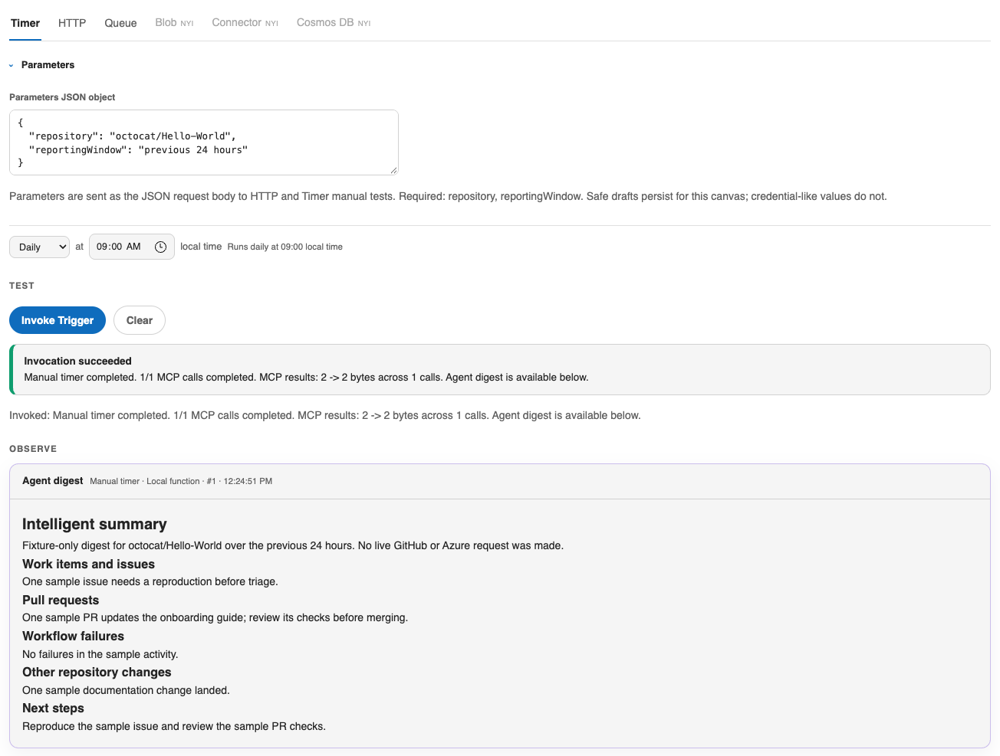

# Azure Functions Hosted Skills

Build and run a local Hosted Skill, or invoke a supported function in an
existing Azure Function App. Start with a Timer, HTTP, or Queue trigger and
inspect its output in the canvas.



*GitHub Copilot canvas browser fixture: sample repository activity, not a live GitHub or Azure result.*

## Install

**Install the full plugin.** The production marketplace currently lists the
0.5.3 candidate from main, but a matching immutable 0.5.3 tag is not published
yet. If your GitHub Copilot host can access this marketplace, use
**Customize > Plugins > marketplace gear > add
`microsoft/azure-dev-tools` (ID `azure-dev-tools`) > install Azure Functions
Hosted Skills**. This installs the canvas and both launcher skills. Fully quit
and reopen GitHub Copilot, start a fresh chat, and confirm both
`azure-functions-hosted-skills-canvas` and
`azure-functions-hosted-skills-github-daily-digest` are available.

The CLI equivalent is:

```sh
copilot plugin marketplace add microsoft/azure-dev-tools
copilot plugin install azure-functions-hosted-skills@azure-dev-tools
```

For a reproducible released checkout, install the full 0.5.2 plugin from its
current immutable tag:

```sh
git clone --depth 1 --branch azure-functions-hosted-skills-v0-5-2-8af10f8 https://github.com/microsoft/azure-dev-tools.git azure-functions-hosted-skills-plugin
copilot plugin install ./azure-functions-hosted-skills-plugin/canvases/azure-functions-hosted-skills
```

The marketplace follows main rather than an immutable source tag. Do not
describe 0.5.3 as immutable until its source-qualified tag is published.

> **Canvas-only fallback:** If the full plugin is unavailable, use
> **Customize → Canvases → Install from gist/URL** with the nested
> `https://github.com/microsoft/azure-dev-tools/tree/azure-functions-hosted-skills-latest/canvases/azure-functions-hosted-skills/extensions/azure-functions-hosted-skills`
> URL. The `-latest` tag is movable and currently uses the 0.5.2 extension
> layout. This installs the canvas only, not the routing or daily-digest
> launcher skills. New apps still receive the required `.funcignore`
> exclusions; unsafe deployment is refused.

The native host discovers
`com.github.copilot/extensions/azure-functions-hosted-skills/extension.mjs`; do not run npm,
bootstrap a second provider, or copy the source folder.

See the
[Azure Functions Hosted Skills README](https://github.com/microsoft/azure-dev-tools/blob/azure-functions-hosted-skills-latest/canvases/azure-functions-hosted-skills/README.md)
for this quickstart and safety guidance. The `-latest` links refer to the
previous release until the 0.5.3 candidate is approved and tagged.

Then ask:

```text
Open Azure Functions Hosted Skills canvas
```

## What you can do

- Turn a repository-digest prompt into a local Timer, HTTP, or Queue skill.
- Invoke a trigger and inspect its agent digest and activity in one view.
- Select an existing Function App and confirm invocation of a supported
  deployed function.

## Prerequisites

- A GitHub Copilot environment that supports installing and opening canvas
  extensions.
- [Azure CLI](https://learn.microsoft.com/cli/azure/install-azure-cli)
  installed and authenticated with `az login`.
- [Azure Functions Core Tools v4](https://learn.microsoft.com/azure/azure-functions/functions-run-local)
  and Node.js.
- GitHub CLI (`gh`) signed in for the bundled repository-digest example.
- `uv` (preferred) or Python 3.13 or later. When `uv` is available, the canvas
  can provision the required Python version for the generated app.
- Azurite for the first local run.
- A compatible model in the current GitHub Copilot session, or access to an
  existing Microsoft Foundry deployment or governed Azure AI Gateway model.

Open **Doctor → Run Doctor** for a read-only check of the required tools,
Python package access, Azure CLI sign-in, and extension registration. Azure
Developer CLI (`azd`) is optional unless you choose **Create Models** or
**Deploy to Azure**.

## First local run

1. Select **Local Function App**. The canvas creates the bundled starter in
   `functions/daily-repo-digest` in the current worktree; use **Change** before
   creation to choose another subfolder.
2. In **Parameters JSON object**, keep
   `{"repository":"Azure/azure-functions-host"}` or replace it with an
   `owner/repo` value or GitHub repository URL.
3. Under **MODEL ENDPOINT**, keep the default **GitHub Copilot** provider and
   review the selected model. The canvas prefers GPT-5 mini when that model is
   available in the current session; otherwise it uses the first compatible
   model in the host-provided catalog. Choose **Microsoft Foundry** or
   **Azure AI Gateway** only when you want an Azure-backed model; those
   providers then require an Azure subscription.
4. Select **Start local function**. The canvas prepares an isolated Python
   environment, installs the app dependencies, starts Azurite when needed, and
   starts the local Functions host.
5. Select **Timer**, review the skill instructions, and select
   **Invoke Trigger**.
6. Review **Agent digest**, **Trigger activity**, **Commands**, and the
   **Local function host log**.

Switching Timer, HTTP, and Queue only changes the selected view; it does not
rewrite the generated app or restart the local host. A new Queue skill is
created when you save its instructions, open it in VS Code, start the host, or
invoke it. Existing apps do not synthesize missing skills. An invalid Queue
test-input draft stays in the editor when you switch away and back; correct it
before invoking.

You can also use **Open existing app…** for a local folder that contains
`host.json` and at least one valid `.agent.md` file. Local Queue invocation
writes only to Azurite. Microsoft 365 Inbox invocation uses representative
dry-run data and does not call Outlook locally.

## Invoke an existing Azure Function App

1. Select **Azure Function App**.
2. Choose the Azure subscription and Function App.
3. Select a discovered function. The canvas identifies whether its HTTP,
   Timer, or Storage Queue trigger has a supported invocation contract.
4. Enter optional test input and select **Invoke**.

Remote invocation sends a real request or queue message to the selected Azure
resource. Unsupported trigger types remain unavailable rather than being
guessed. Remote response capture is not guaranteed; use the bounded trigger
activity and Application Insights views to confirm the result.

## Prompts to try

```text
Open Azure Functions Hosted Skills canvas and run Doctor before I build a local skill.
```

```text
Open Azure Functions Hosted Skills canvas so I can try a daily GitHub repository digest for octocat/Hello-World with the Timer trigger.
```

```text
Open Azure Functions Hosted Skills canvas so I can choose an existing Function App and confirm an invocation.
```

## Troubleshooting

- If the canvas is missing after installation, fully quit and reopen GitHub
  Copilot, start a fresh project chat, and retry the exact open prompt.
- For the 0.5.2 canvas-only install, use the nested
  `extensions/azure-functions-hosted-skills` URL, not the plugin directory.
  The 0.5.3 marketplace candidate uses the newer namespaced extension layout.
- Run **Doctor** and follow its specific fixes for PATH, Python, Core Tools,
  Node.js, Azurite, Azure CLI sign-in, package-index access, or duplicate
  installations.
- If Azure resources or models are absent, verify `az account show`, the
  selected subscription, and your read/invoke permissions, then refresh.
- Do not install a second provider to work around a stale registration. Disable
  retired or duplicate registrations through GitHub Copilot, preserve generated
  apps and state, reinstall the canonical extension, and restart the app.

## Safety and authentication

- The extension uses your Azure CLI identity and never signs in for you.
- **Doctor** is read-only and never installs software or changes Azure.
- **Create Models** and **Deploy to Azure** create or change real Azure
  resources and require an explicit action in the canvas.
- **Invoke** can execute a local trigger or send real traffic to the selected
  Azure Function App. Review the target and input before invoking.
- Load testing sends throttled real HTTP traffic. It does not create, modify,
  scale, or deploy Azure resources, but it can affect the target workload.
- Generated app files are created in the selected subfolder. Removal stops if
  managed files were changed, to avoid deleting user work.
- A new generated app receives the bundled `src/.funcignore` exclusions even
  if a URL installer omits the hidden template file. Deployment refuses a
  missing or incomplete `.funcignore` in the deployment snapshot; restore
  required exclusions in an existing or attached app yourself. The canvas
  does not overwrite its ignore-file edits.

The Azure CLI login remains yours. The canvas does not log in automatically.
Local development still needs the tools reported by Doctor; generating an app
clones the existing daily-digest template repository on explicit request.
New apps restore the bundled `.funcignore` from a visible companion if the
installer omits the hidden file. Deployment refuses missing required
exclusions without rewriting an existing workspace. Runtime user state is
outside this payload and must be preserved during upgrade or rollback.

Reload extensions after an update. If multiple providers are installed, select
the intended host-declared extension ID; never bypass the launcher's occupied
panel guard. Missing native registration is a host installation problem, not a
reason to create a user extension link.

## Product-usage telemetry

Product-usage telemetry is disabled by default. When explicitly configured,
the canvas enqueues only code-defined action, outcome, and panel-control
metadata. Delivery is asynchronous, bounded, memory-only, Entra-authenticated,
and provided by `@microsoft/canvas-toolkit/telemetry`. This canvas supplies the
approved endpoint, audience, token provider, and explicit opt-in policy; the
toolkit does not choose or provision telemetry resources.
Telemetry failures never alter an action result. Prompts,
inputs, outputs, resource IDs, repository names, URLs, paths, commands, raw
errors, tokens, and secrets are excluded.

App `package.json` is the version authority; release inventory and checksums
describe the exact bytes, not authenticity or permission to publish.

## Learn more

- [Azure Functions Hosted Skills documentation](https://aka.ms/canvas-hostedskills-docs)
