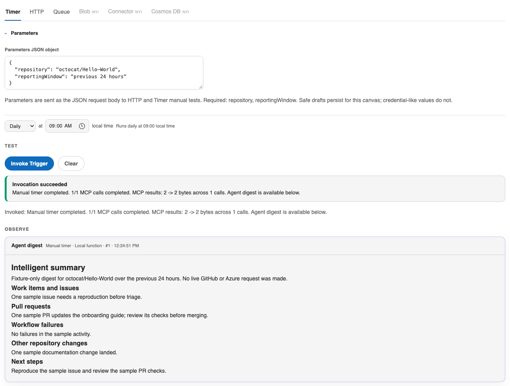

# Azure Functions Hosted Skills

Create and run a local Timer, HTTP, or Queue Hosted Skill, or select an existing
Azure Function App and invoke a supported deployed function.



*GitHub Copilot canvas browser fixture: sample repository activity, not a live GitHub or Azure result.*

## Install

If your GitHub Copilot host shows the **awesome-copilot** marketplace, open
**Customize → Plugins** and install **Azure Functions Hosted Skills**. The
[listed 0.5.3 package](https://github.com/microsoft/azure-dev-tools/tree/a873dfa42ce8e4420b77e94ddca896e8771e3b0c/canvases/azure-functions-hosted-skills)
is not this 0.5.5 candidate. The full plugin installs
the canvas and both launcher skills. If the marketplace is missing, add it first:

```sh
copilot plugin marketplace add github/awesome-copilot
copilot plugin install azure-functions-hosted-skills@awesome-copilot
```

Reopen Copilot and start a fresh chat. You need Azure CLI; local authoring
also needs Functions Core Tools v4 and Python (or `uv`).
Use **Doctor** for exact prerequisites. For version-pinned and canvas-only
alternatives, see [installation notes](docs/advanced.md).

## Try it

Ask **Open Azure Functions Hosted Skills canvas**. Choose **Local Function
App**, review the sample repository in **Parameters JSON object**, then select
**Start local function**. Choose **Timer** and **Invoke Trigger**; review the
**Agent digest** and **Trigger activity**. Remote invocation sends a real
request to the selected Azure Function App and requires your confirmation.

## What you can do

- Turn a repository-digest prompt into a local Timer, HTTP, or Queue skill.
- Invoke a trigger and inspect both its agent digest and activity in one view.
- Select an existing Function App to invoke a supported deployed function, with confirmation.

## Prompts to try

> Open Azure Functions Hosted Skills canvas and run Doctor before I build a local skill.

> Open Azure Functions Hosted Skills canvas so I can try a daily GitHub repository digest for octocat/Hello-World with the Timer trigger.

> Open Azure Functions Hosted Skills canvas so I can choose an existing Function App and confirm an invocation.
