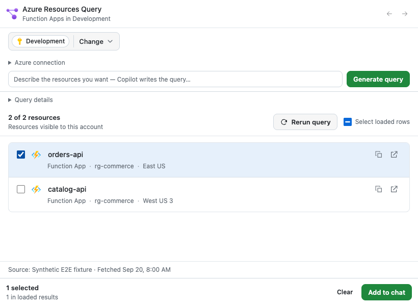

# Azure Resources Query

Find Azure resources with read-only Resource Graph queries, inspect results in
the panel, and add selected resources to chat without dumping an inventory.



*Illustrative fixture data, not a live Azure subscription.*

## Install

If your GitHub Copilot host shows the **awesome-copilot** marketplace, open
**Customize → Plugins** and install **Azure Resources Query**. The
[0.1.3 production package](https://github.com/microsoft/azure-dev-tools/tree/a873dfa42ce8e4420b77e94ddca896e8771e3b0c/canvases/azure-resources-query)
is an earlier build; check the marketplace listing for the version it offers now.
This installs the full plugin: the canvas and its launcher skill.
If the marketplace is missing, add it first:

```sh
copilot plugin marketplace add github/awesome-copilot
copilot plugin install azure-resources-query@awesome-copilot
```

Reopen Copilot and start a new chat. Requires Azure CLI 2.61+ and Azure read
access. See
[installation alternatives](docs/advanced.md) for an exact version or a
canvas-only URL.

## Try it

Ask: **Show my Function Apps in Development** (replace Development with your
subscription). Confirm the scope in the panel; an unscoped request never
silently selects subscriptions. Open a result to inspect details, select rows,
then choose **Add to chat**. Refine with **Only those in West Europe**.

## What you can do

- Find Function Apps, VMs, or storage accounts with read-only Resource Graph queries.
- Confirm subscription scope in the panel before results appear.
- Inspect resources and add selected rows to chat without pasting an inventory.

## Prompts to try

> Show my Function Apps in Development.

> Show my storage accounts in Development, then filter to West Europe.
