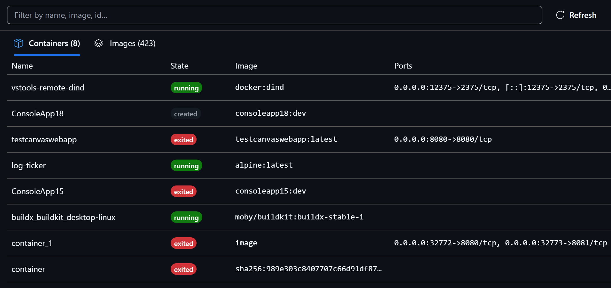

# Containers

Browse and operate your local Docker or Podman containers and images in a
panel: sortable lists, live log streaming with filtering, CPU and memory
charts, a filesystem browser, image layer size breakdown, and recorded
Dockerfile provenance.

## Install

In GitHub Copilot, open **Customize → Plugins → marketplace gear**, add
`microsoft/azure-dev-tools` (marketplace ID `azure-dev-tools`), and install
`containers` when listed. The full plugin includes the canvas and its opening
skill.

For canvas-only installation, add the [Containers canvas URL](https://github.com/microsoft/azure-dev-tools/tree/containers-latest/canvases/containers/com.github.copilot/extensions/containers)
under **Customize → Canvases → +**. This does not install the opening skill;
open **Containers** from your installed canvases.

The [latest customer README](https://github.com/microsoft/azure-dev-tools/blob/containers-latest/canvases/containers/README.md)
contains the same setup instructions. Use these paths only when published; if
neither is available, report that rather than substituting a source folder.

## Quickstart

1. With the full plugin installed, ask Copilot: **"Open Containers canvas."**
   For a canvas-only installation, open **Containers** from installed canvases.
2. Choose a container to inspect its status, ports, mounts and lifecycle
   controls.
3. Open **Logs** to follow output or **Stats** to watch CPU, memory and network.
4. Ask **"Why did web stop?"** or **"Why is my node image so large?"** and
   Copilot opens the matching view.

## What you can do

- See every container and image, sorted, with live state from the daemon.
- Follow logs as they stream, and filter them.
- Watch CPU, memory and network for a running container.
- Browse the filesystem of a running container that provides `ls`, and read a
  known file path from stopped or distroless containers.
- Break an image into layers to see what made it large.
- Recover what an image records about its source repository and commit.
- Get an interactive shell in a running container — click **terminal** in the
  panel, or just ask Copilot.

## Requirements

- A canvas-capable GitHub Copilot host
- Node.js 22 or later
- Docker Desktop or Docker Engine with a reachable daemon

Podman is detected when Docker is absent and its core paths work, but it has not
received the same real-daemon qualification as Docker.

## Troubleshooting

- **Canvas unavailable:** check that the plugin is enabled, reload extensions,
  fully quit and reopen GitHub Copilot, then retry in a fresh chat.
- **No containers or images:** verify that Docker is installed and that its
  daemon is running, then reopen the canvas.
- **Permission denied:** confirm your user can run `docker ps` without
  elevation. The canvas uses the same local runtime access.
- **Terminal unavailable:** the interactive shell is handed to the host
  Terminal canvas. Use the displayed `docker exec` command in your own terminal
  when that canvas is unavailable.
